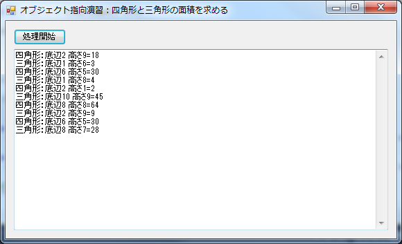

# オブジェクト指向プログラミングの演習用リポジトリ
オブジェクト指向プログラミングにおいて、以下の項目の習得をするための演習問題です。

1. 新規クラスの作成
- クラスの設計：既存のプログラムを分析して、クラスを作成する
- 親クラスと子クラスを設計する
- アクセス子(public, protected, private)を適切に設定する
- 自らの配列の処理は自ら行う(static)
- ポリモーフィズムで分岐処理と配列を簡単にする

このリポジトリをForkして、手順に従って解答してください。
指示通りに作業するのではなく、これまでの資料やインターネットの情報を活用して、
自ら問題を解決してください。周りの人と相談しても構いません。

# 作成するプログラム


- ボタンが１つと、複数行のTextBoxが１つ配置されたフォームを持つ
- 起動時に、任意の数の四角形と三角形を生成して、それぞれ、底辺と高さを1～10の乱数で求める
- ボタンを押すと、生成した四角形と三角形の面積を求めて、TextBoxに出力する

# 作業準備
1. GitHubにサインインする
- このリポジトリをフォーク(Fork)する
- GitHub Desktopを起動
- 左上の[+]を押して、[Clone]を選択
- 画面左から自分のアカウントを選択して、「obj-prac」を選択して、[Clone obj-prac]を押す(見つからない場合は、[Filter repositories]欄に「obj」などと入力する)
- 「フォルダーの参照」ウィンドウが表示されたら、そのまま[OK]を押す
- 画面左から[obj-prac]を選択して、右クリック>[Open in Explorer]を選択
- [obj-prac.sln]をダブルクリックしてプロジェクトを開く
- ソリューションエクスプローラ(Solution Explorer)から[Form1.cs]をダブルクリックして、フォームを表示する(ソリューションエクスプローラが表示されていない時は、[表示(View)]>[ソリューションエクスプローラ(Solution Explorer)]を選択する)

以上で作業用のプロジェクトのクローンと、プロジェクトを開くことができます。実行して、動きを確認してください。

# 作業1：プログラムの確認
最初のプログラムはForm1.csファイル内に全て記載されています。この中から、図形の親クラスとなるCZukeiと、四角形のクラスCShikakuと、三角形のクラスCSankakuの3つのクラスを新しく作成して、プログラムを整理していきます。

## 手順
1. 画面上の[Wiki]を右クリックして、[新しいタブで開く]
- [Create the first page]を押して、新しいWikiページを作成
- プログラムを参照して、クラスに定義されている変数を全て箇条書きに抜き出す
- それぞれの変数が、Form1，CZukei，CShikaku，CSankakuのどれで使われるかを併せて記載する
  - 例えば、randは全てで使われるので、「- rand(すべて)」などと書く
- 関数を全て箇条書きで書き出す
- 変数と同じように、関数がどのクラスで使われるかを追記

# 作業2：クラス設計
確認した各変数と各関数が、Form1、CZukei、CShikaku、CSankakuのどこに定義するかを決めましょう。

- 変数は、上記のいずれか一箇所のみに定義する
- 関数は、ポリモーフィズムの都合で、CZukei、CShikaku、CSankakuに同時に実装される可能性がある

## 手順
1. 作業1で作成したWikiに、上記について追記する

# 作業3：CZukeiの作成
設計に従って、CZukeiを新規に作成しましょう。

これ以降は、具体的な作業方法は示しません。授業の資料やインターネットで検索をして、自分の頭で考えて、自力で解決してください。

## 作業手順の概要
1. CZukeiクラスを新規に作成
- Form1から、CZukeiが持つべき変数と関数を移動
- 配列は、staticを利用して、CZukei自身に持たせる
- コンストラクタを作成して、instantiateShikakuとinstantiateSankakuの共通部分を移動
- randが必要になるので、Form1のrandの定義を修正して使えるようにする
- ポリモーフィズムを使う関数calcをabstractで定義
- エラーが発生するので解消する
  - ヒント：abstract関数を１つでも持ったクラスは、abstractクラスにする必要がある

# 作業4：CShikakuの作成
設計に従って、CZukeiを継承した子クラスCShikakuを新規に作成しましょう。

## 作業手順の概要
1. CShikakuクラスを新規に作成
2. CZukeiを継承するためのコードをクラスの定義の行に追加
3. Form1からinstantiateShikakuを移植する。授業で行った同様の作業を参考にして、static関数で実装する
4. ポリモーフィズムを使う関数calcをoverrideして、処理をForm1から移植する
5. CZukeiに、全てのcalcを実行するstatic関数calcAll()を実装する。weをループでまわして、すべてのcalcを呼び出す
  - ヒント1：宣言は「public static void calcAll(TextBox text)」にするとよい
  - ヒント2：そのままではTextBoxでエラーが発生する。授業でLabelのエラーを解消した時と同じ手順で修正できる
  - ヒント3：Form1からは「CZukei.calcAll(textBox1);」で呼び出す
  - ヒント4：表示の折り返しは"\r\n"
5. 作成したクラスを使って、四角形の面積が表示されるようにForm1を調整して実行する
  - ヒント1：コンストラクタのforループ内のコードを削除してから、CShikakuのinstantiate関数を追加
  - ヒント2：button1を押した処理の中身を削除して、CZukei.calcAll();を呼び出す

# 作業5:CSankakuの作成
設計に従って、CZukeiを継承した子クラスCSankakuを新規に作成しましょう。

作成手順は四角形の1～4と6のヒント1と同様です。

# 完成したら
以上でクラス化は完了です。Form1に不要なコードが残っていたら削除してください。

全ての作業が終わったら、以下を行って、GitHubに反映させてください。

1. Visual Studioを全て保存して、閉じる
2. GitHub Desktopで[Changes]を選択
3. [Summary]欄に「完成」などと入力して、コミット(Commit)して、GitHubに反映させる(PublishかSyncを押す)

以上です。


# Pull Requestの作成
課題に対してコメントをするために、以下の手順でPull Request(プルリクエスト)を作成してください。

- github.comをWebブラウザーで開く
- 自分のアカウントでSign inする
- [Your repositories]から[obj-prac]を選択
- 緑色の[New pull request]を押す
- [Create pull request]を押す
- タイトルに何か表示されているが、そのまま右下の[Create pull request]を押す(タイトルが空欄だったら、質疑応答などのタイトルをつける)
以上で完了。

これで、田中のところにPull requestが届いて、コメントのやりとりができるようになります。

以降、[Pull requests]ボタンを押して、作成したPull Requestのタイトルをクリックすると、田中とのコメントのやりとりができます。


# calcAll()とcalc()に関するヒント
2/12の講義中に説明したメモは以下の通りです。

```
①呼び出し側
for (int i = 0; i < type.Count; i++) 
{ 
    textBox1.AppendText(calc(i) + "\r\n"); 
}
↓
textBox1.AppendText(表示したい文字列);
「表示したい文字列」をtextBox1に出力する方法

②呼び出され側
calc(i)は・・・i番目の図形の面積を求めて、結果の文字列を返す

-------------------
CZukei.calcAll(textBox1.Text + "\r\n");
↓
CZukei.calcAll(textBox1);


public static void calcAll(TextBox text) 
{ 
    // text = textBox1
    foreach (CZukei me in we) 
    { 
        me.calc();     // ←ここを修正
        // textBox1.AppendText(calc(i) + "\r\n");
        // 上記のコードを、この関数内で動くように書き換える
    } 
} 

```

